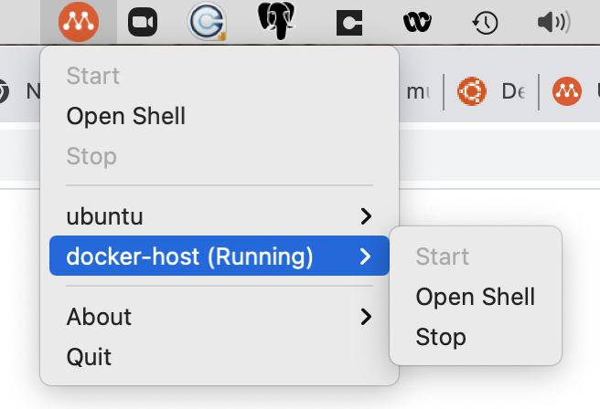

# multipass-docker-engine
Using hyperkit to create a local Docker Engine for macOS to replace Docker Desktop.

After Docker [announced changes](https://www.docker.com/blog/updating-product-subscriptions/) to the subscription model for Docker on mac OS (Docker Desktop, also affects Docker Desktop for Windows), you might want to try out a lightweight Linux-based "container" to run Docker Engine, without needing to install, licence, and configure VirtualBox, VMware Fusion, or similar virtual machine managers.

macOS provides Hyperkit, based on [xhyve](https://github.com/machyve/xhyve) which in turn is based on Apple's [Hypervisor.framework](https://developer.apple.com/documentation/hypervisor), which is actually used by Docker Desktop to run its container management capability.

[Ubuntu Multipass](https://multipass.run/) provides lightweight Linux container environment that can run on macOS using Hyperkit (in fact, it's the default).

## Install Ubuntu Multipass
Follow the download and installation instructions at https://multipass.run/ or install via brew (`brew install --cask multipass`), and bring up your Docker Engine "host":
```
$ multipass launch --name docker-host
$ multipass exec docker-host bash
ubuntu@ubuntu:~$ 
```
*Beware!* VPN software can (and probably will) screw up the routing and/or DNS resolution -- if you are unable to `ping github.com` from the ubuntu shell, you should try stopping/terminating your VPN software and restart the instance:
```
$ multipass restart docker-host
```
If that still doesn't _resolve_ the DNS problem, you may need to modify the DNS nameserver setting for `systemd-resolved` to point to something well-known, like 8.8.8.8. (modify `/etc/systemd/resolved.conf`)
```
[Resolve]
DNS=8.8.8.8
```

## Installing Docker Engine
Docker provides a couple of options for [installing Docker Engine](https://docs.docker.com/engine/install/ubuntu/):
 1. set up `apt` to recognise Docker repositories, and install via `sudo apt-get install`
 2. download `.deb` package files directly from Docker and install via `sudo dpkg -i`

The second option takes fewer steps and produces the same results; current (2021/09) ubuntu builds applicable to Big Sur and Catalina can be found in the `focal` distribution - https://download.docker.com/linux/ubuntu/dists/focal/pool/stable/amd64/

From within the multipass instance shell (`multipass shell docker-host`) :

```
$ wget https://download.docker.com/linux/ubuntu/dists/focal/pool/stable/amd64/docker-ce_20.10.8~3-0~ubuntu-focal_amd64.deb
$ wget https://download.docker.com/linux/ubuntu/dists/focal/pool/stable/amd64/docker-ce-cli_20.10.8~3-0~ubuntu-focal_amd64.deb
$ wget https://download.docker.com/linux/ubuntu/dists/focal/pool/stable/amd64/containerd.io_1.4.9-1_amd64.deb
$ sudo dpkg -i *deb
Selecting previously unselected package containerd.io.
(Reading database ... 60%
(Reading database ... 63510 files and directories currently installed.)
Preparing to unpack containerd.io_1.4.9-1_amd64.deb ...
Unpacking containerd.io (1.4.9-1) ...
Selecting previously unselected package docker-ce-cli.
Preparing to unpack docker-ce-cli_20.10.8~3-0~ubuntu-focal_amd64.deb ...
Unpacking docker-ce-cli (5:20.10.8~3-0~ubuntu-focal) ...
Selecting previously unselected package docker-ce.
Preparing to unpack docker-ce_20.10.8~3-0~ubuntu-focal_amd64.deb ...
Unpacking docker-ce (5:20.10.8~3-0~ubuntu-focal) ...
Setting up containerd.io (1.4.9-1) ...
Created symlink /etc/systemd/system/multi-user.target.wants/containerd.service → /lib/systemd/system/containerd.service.
Setting up docker-ce-cli (5:20.10.8~3-0~ubuntu-focal) ...
Setting up docker-ce (5:20.10.8~3-0~ubuntu-focal) ...
Created symlink /etc/systemd/system/multi-user.target.wants/docker.service → /lib/systemd/system/docker.service.
Created symlink /etc/systemd/system/sockets.target.wants/docker.socket → /lib/systemd/system/docker.socket.
Processing triggers for man-db (2.9.1-1) ...
Processing triggers for systemd (245.4-4ubuntu3.11) ...
```
Test that docker is alove and well:
```
$ sudo docker run hello-world
Unable to find image 'hello-world:latest' locally

latest: Pulling from library/hello-world
b8dfde127a29: Pull complete 
Digest: sha256:7d91b69e04a9029b99f3585aaaccae2baa80bcf318f4a5d2165a9898cd2dc0a1
Status: Downloaded newer image for hello-world:latest

Hello from Docker!
This message shows that your installation appears to be working correctly.

To generate this message, Docker took the following steps:
 1. The Docker client contacted the Docker daemon.
 2. The Docker daemon pulled the "hello-world" image from the Docker Hub.
    (amd64)
 3. The Docker daemon created a new container from that image which runs the
    executable that produces the output you are currently reading.
 4. The Docker daemon streamed that output to the Docker client, which sent it
    to your terminal.

To try something more ambitious, you can run an Ubuntu container with:
 $ docker run -it ubuntu bash

Share images, automate workflows, and more with a free Docker ID:
 https://hub.docker.com/

For more examples and ideas, visit:
 https://docs.docker.com/get-started/
```
And Docker Engine is up and running.

## Configure Docker Engine for macOS access
By default, Docker Engine is configured to only run using the local sock interface; to be able to use from you macOS docker cli, you will need to configure Docker Engine to listen over TCP.

Docker Engine is installed as a systemd-managed service - the systemd config needs to be [modified for TCP connections](https://docs.docker.com/engine/install/linux-postinstall/#configure-docker-to-start-on-boot) with a couple of steps:

```
$ sudo systemctl edit docker.service
```
Edit and save the ExecStart statements to include new TCP and existing containerd settings:
```
[Service]
ExecStart=
ExecStart=/usr/bin/dockerd -H fd:// -H tcp://0.0.0.0:2375 --containerd=/run/containerd/containerd.sock
```
Now restart the docker service:
```
$ sudo systemctl daemon-reload
$ sudo systemctl restart docker.service
$ ip -f inet addr
1: lo: <LOOPBACK,UP,LOWER_UP> mtu 65536 qdisc noqueue state UNKNOWN group default qlen 1000
    inet 127.0.0.1/8 scope host lo
       valid_lft forever preferred_lft forever
2: enp0s2: <BROADCAST,MULTICAST,UP,LOWER_UP> mtu 1500 qdisc fq_codel state UP group default qlen 1000
    inet 192.168.64.21/24 brd 192.168.64.255 scope global dynamic enp0s2
       valid_lft 78875sec preferred_lft 78875sec
3: docker0: <BROADCAST,MULTICAST,UP,LOWER_UP> mtu 1500 qdisc noqueue state UP group default 
    inet 172.17.0.1/16 brd 172.17.255.255 scope global docker0
       valid_lft forever preferred_lft forever
$ sudo netstat -lntp | grep dockerd
tcp6       0      0 :::2375                 :::*                    LISTEN      709/dockerd 
```
Note the ip address of your docker-host - either from the ip command within the instance, or with `multipass info docker-host`:
```
$ multipass info docker-host
Name:           docker-host
State:          Running
IPv4:           192.168.64.21
                172.17.0.1
Release:        Ubuntu 20.04.3 LTS
Image hash:     97bb9f79af52 (Ubuntu 20.04 LTS)
Load:           0.00 0.00 0.00
Disk usage:     2.0G out of 4.7G
Memory usage:   196.3M out of 981.3M
Mounts:         --
```

Docker Engine will now accept commands from a remote docker client (like the one you use in your macOS terminal).

## Stop/Start your Docker Engine
Much like Docker Desktop, your multipass docker-host instance needs to be running before any clients can make use of it:

```
multipass start docker-host
```
Should be sufficient to spin up the instancee wheen you need it, and 
```
multipass stop docker-host
```
when you don't.

You can also use the Multipass GUI control from the menu-bar:




## macOS Docker client

From a macOS terminal run the docker command 
```
$ DOCKER_HOST=<docker-host-IPv4-address> docker images
REPOSITORY    TAG       IMAGE ID       CREATED             SIZE
hello-world   latest    d1165f221234   6 months ago        13.3kB
```
To more permanently direct your docker client to your multipass docker-host instance, add
```
export DOCKER_HOST=<docker-host-IPv4-address>
```
to your `~/.bashrc` and/or `~/.zshrc`

## Sizing considerations

By default, Multipass will create Ubuntu instances with 1 CPU, 5GB hard disk and 1GB RAM. This is enough for basic testing.

However, some times you might want to create a instance with lower or higher configuration than the default. 

*Docker would be an obvious candidate for higher values all round.*

The following command will spin up an instance with 2 CPUs, 4 GB RAM and 20 GB hard disk size.
```
$ multipass launch -c 2 -m 4G -d 20G -n big-docker-host
```

## Feedback
Comments on your experiences welcome via Issues.


